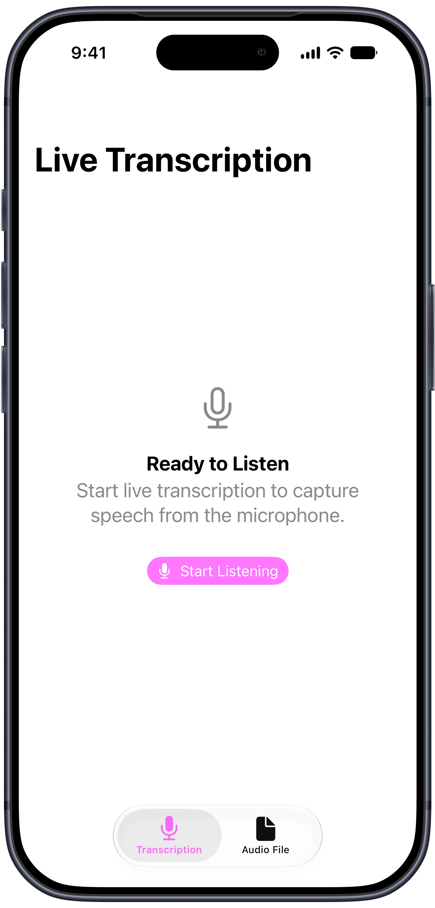
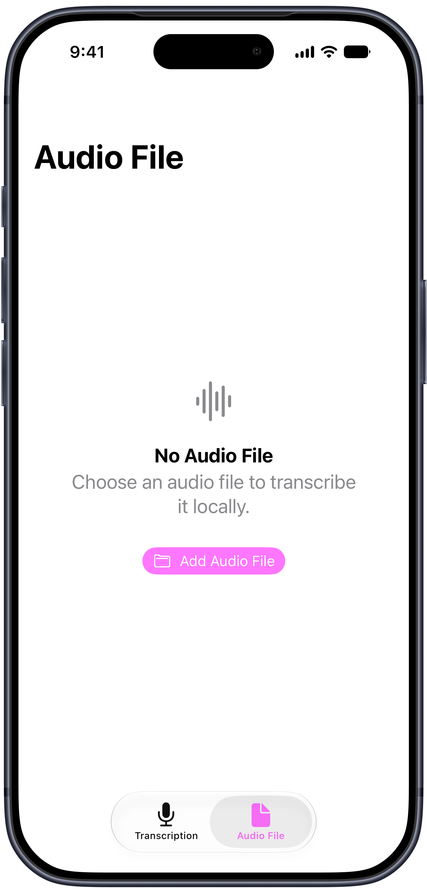

# Localisten for iOS

**Localisten** is a small SwiftUI showcase app for on-device live and audio-file transcription using Apple's [Speech framework](https://developer.apple.com/documentation/speech). It demonstrates `SpeechAnalyzer` and `SpeechTranscriber` in a minimal native interface, without a backend or API key.

## Screenshots

| Live transcription | Audio-file transcription |
| --- | --- |
|  |  |

## Features

- **[Live transcription](docs/features/live-transcription.md)**: Capture microphone audio and display recognized speech as it arrives. Stop recording to keep the transcript, or reset to start again.
- **[Audio-file transcription](docs/features/audio-file-transcription.md)**: Import an audio file and transcribe it on-device.
- **Transcript display**: Read and select recognized text, then reset for another file.
- **Errors**: View error messages, with an option to choose another file.

## Requirements

- Xcode 26 or later and an iPhone running iOS 26 or later.
- A device and recognition language supported by `SpeechTranscriber`.
- Network access when required speech assets need to be downloaded.

Recognition uses the device's current locale. Once the required assets are installed, audio is processed locally.

## Quick Start

1. Open `Localisten.xcodeproj` in Xcode.
2. Under Signing & Capabilities, select your development team and set a unique bundle identifier. Choose a supported iPhone.
3. Run the app and tap **Start Listening**, then allow microphone access. Alternatively, open **Audio File** and tap **Add Audio File**.

## How it works

Both flows are implemented in [TranscriptionService.swift](Localisten/Services/TranscriptionService.swift):

1. Find a supported recognition locale equivalent to the device's current locale.
2. Create a `SpeechTranscriber` and use `AssetInventory` to download any required speech assets.
3. Create a `SpeechAnalyzer` with the transcriber as its module and read `transcriber.results` asynchronously while the analyzer processes audio.
4. Finalize the analysis when the audio ends so the remaining results can arrive.

**Live transcription** uses the `.progressiveTranscription` preset. An `AVAudioEngine` microphone tap feeds audio buffers into an asynchronous stream, converting their format when needed. The app combines finalized phrases with the current provisional text. Stop ends the audio input and allows final results to arrive; Reset cancels the session and clears the transcript. The [live view model](Localisten/LiveTranscription/LiveTranscriptionViewModel.swift) manages these states and uses a session ID to ignore results and cleanup from an obsolete task.

**Audio-file transcription** uses the `.transcription` preset. The analyzer reads an imported `AVAudioFile`, and the app collects final results into a single transcript. The [audio-file view model](Localisten/AudioFileTranscription/AudioFileTranscriptionViewModel.swift) manages file selection, progress, completion, and errors.

## Apple Documentation

- [SpeechAnalyzer](https://developer.apple.com/documentation/speech/speechanalyzer): Audio analysis and session finalization.
- [SpeechTranscriber](https://developer.apple.com/documentation/speech/speechtranscriber): Recognition locales, transcription presets, and streamed results.
- [AssetInventory](https://developer.apple.com/documentation/speech/assetinventory): System-managed speech model assets.
- [WWDC25: Bring advanced speech-to-text to your app with SpeechAnalyzer](https://developer.apple.com/videos/play/wwdc2025/277/): Framework introduction and implementation walkthrough.

## Limitations

This is a demonstration app. Live recording stops when its screen is left or the app becomes inactive. Transcripts are not saved, and dedicated sharing, export, and audio-file transcription cancellation are not implemented.

## License

Localisten is available under the MIT License. See [LICENSE](LICENSE) for the full license text.
